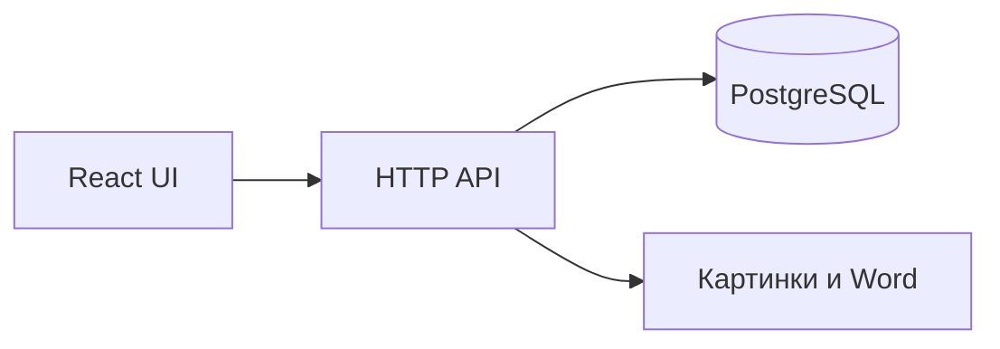

# Переезд Test Case Manager на веб

Интерфейс (страницы, формы, редактор, регресс) остаётся на React. Источник данных меняется: сейчас задача — это файл `*.tctask` на диске, справочники и настройки — ключи в [electron/store.ts](electron/store.ts), доступ идёт через `window.electronAPI` ([electron/ipc/channels.ts](electron/ipc/channels.ts), [src/infrastructure/project/projectFileService.ts](src/infrastructure/project/projectFileService.ts)). В браузере этого API нет, поэтому нужен сервер и база.

## 1. Зафиксировать правила доступа

До схемы базы решить три вещи, иначе модель данных придётся переделывать:

- Общая база на команду или у каждого пользователя только свои задачи. Для методики испытаний обычно общая база: задачи видят все вошедшие, править может автор или любой авторизованный. Роли заложить сразу, даже если на старте роль одна.
- Десктопная сборка остаётся параллельно или веб её заменяет. Пока веб не готов, Electron не удалять: файловый слой вынести за интерфейс, а не вырезать экраны.
- Старые `*.tctask` нужно загрузить в базу один раз. Без импорта текущие методики останутся только на дисках.

## 2. Собрать контур веба

- Фронт — текущий Vite + React, без Electron в браузерной сборке.
- Бэкенд на Node и TypeScript, чтобы переиспользовать разбор `*.tctask` из [src/infrastructure/project/tcprojFormat.ts](src/infrastructure/project/tcprojFormat.ts) и сбор Word из [src/infrastructure/export/docxExportService.ts](src/infrastructure/export/docxExportService.ts).
- База PostgreSQL. Картинки из целей и результатов проверки хранить файлами на сервере, в базе — ссылка и метаданные. В документ задачи их целиком не класть: они уже приходят как вложения.
- Локально API и фронт поднимаются вместе; снаружи один адрес, API за тем же сайтом.

## 3. Разложить файлы по таблицам

Один `*.tctask` перестаёт быть единицей хранения. Таблицы:

- Пользователи: логин, хэш пароля, роль.
- Задачи: поля карточки из `TaskMeta` (название, краткое имя, релиз, приложение, модуль, объект испытаний, цель, требования, риски, родитель). Иерархия задач — `parentTaskId`, как сейчас.
- Тест-кейсы: поля `TestCase`, включая оба флага регресса, цель и шаги как rich text.
- Справочники, которые сейчас в [src/infrastructure/storage/storageKeys.ts](src/infrastructure/storage/storageKeys.ts): люди по ролям, приложения, модули, среды, признак «по умолчанию» у автора и среды. Это общие справочники команды, не личные настройки браузера.
- Вложения: id, задача или кейс, тип, путь к файлу.

Не переносить в базу: `windowBounds`, пути недавних файлов, `lastOpenedProjectPath`. В вебе вместо «недавних файлов» — список задач из базы.

## 4. Вход по логину и паролю

- Пароль только как хэш. Сравнение на сервере.
- Сессия в httpOnly-cookie, не в `localStorage`. Запросы фронта идут с cookie.
- Каждый метод API проверяет сессию. Закрытый интерфейс без входа не отдаёт задачи.
- Первый администратор создаётся при установке, не формой открытой регистрации, если регистрацию с улицы не планируете.
- Смена пароля и выход. Восстановление пароля — отдельным шагом, если почты ещё нет.

## 5. Заменить файловый слой, не экраны

Точки, которые сейчас зовут Electron, перевести на API. Экраны и доменные типы не переписывать заново.

- Открытие и сохранение задачи: [src/infrastructure/project/projectFileService.ts](src/infrastructure/project/projectFileService.ts) и [src/application/project/projectActions.ts](src/application/project/projectActions.ts). «Открыть файл» становится «открыть задачу из списка». Автосохранение пишет `PUT` на сервер, а не `saveToPath`.
- Списки регресса, приложений и каталога кейсов больше не читают пачку файлов с диска ([src/application/regression/loadRegressionGroups.ts](src/application/regression/loadRegressionGroups.ts), [src/application/applications/loadApplicationTaskGroups.ts](src/application/applications/loadApplicationTaskGroups.ts), [src/application/testCases/loadCatalogTestCases.ts](src/application/testCases/loadCatalogTestCases.ts)). Сервер отдаёт уже сгруппированные данные одним запросом.
- Справочник: [src/stores/useDirectoryStore.ts](src/stores/useDirectoryStore.ts) читает и пишет API вместо `appStorageService`.
- Копирование и перенос задач в [src/application/project/taskHierarchyActions.ts](src/application/project/taskHierarchyActions.ts) — операции в базе, без чтения чужого файла по пути.

Порядок включения экранов: вход, список задач, карточка, тест-кейсы, справочник, регресс, Word.

## 6. Картинки и Word

- Вставка скриншота в редакторе загружает файл на сервер и получает URL. В HTML кейса остаётся ссылка, не огромный base64, иначе база и ответы API раздуются.
- Экспорт Word выполняется на сервере и скачивается браузером. Логика документа остаётся в `docxExportService`.
- Импорт Word: браузер отправляет файл, разбор из [src/application/import/wordImportActions.ts](src/application/import/wordImportActions.ts) выполняется на сервере.

## 7. Одновременная правка

На диске файл был у одного человека. В вебе двое могут сохранить одну задачу.

- На запись задачи и кейса хранить `updatedAt`.
- Если клиент шлёт старую версию, сервер отвечает конфликтом, а не затирает чужие правки.
- Автосохранение шлёт только изменённый кейс или карточку, не весь архив задачи на каждое нажатие клавиши.

## 8. Перенос уже созданных методик

- Команда импорта читает `*.tctask` тем же `parseTaskFileContent`, создаёт задачу, кейсы и вложения.
- Повторный импорт того же файла не плодит копии: сверка по id задачи из файла.
- Справочники из `electron-store` выгружаются отдельно и один раз заливаются в общие таблицы. Иначе в вебе списки «Приложение» и «Модуль» окажутся пустыми, хотя в десктопе они заполнены.

## 9. Выкладка и доступ

- HTTPS, cookie с флагом Secure.
- База и каталог картинок не торчат в интернет напрямую, только через API.
- Резервная копия базы и каталога вложений. Без этого потеря сервера стирает все методики.
- Учётные записи не светятся в логах и в ответах об ошибках.

Десктопный установщик и `electron-builder` после переезда не нужны для веба. Их имеет смысл оставить, пока команда ещё работает в установленной версии и пока импорт старых файлов не проверен.
